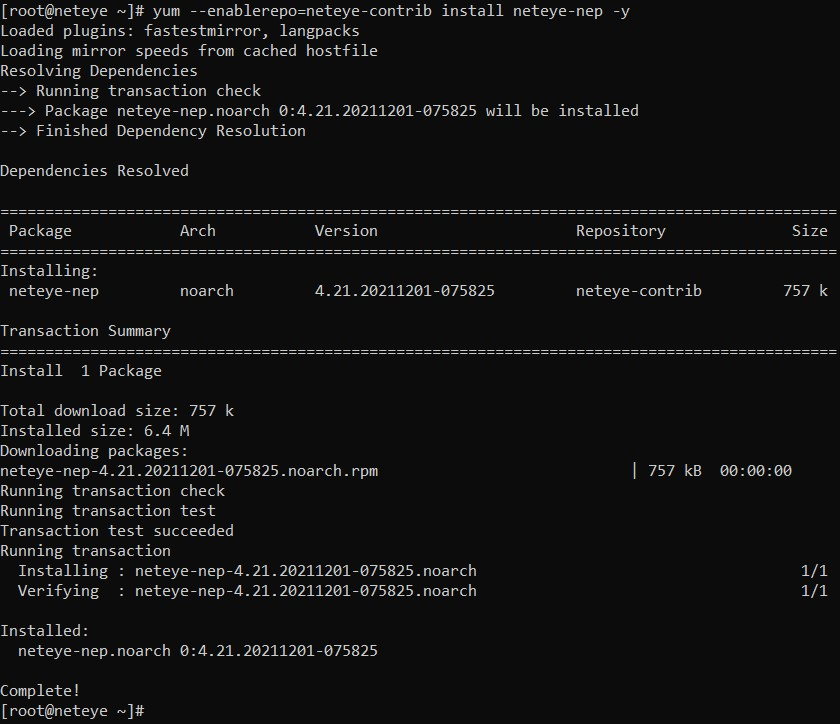
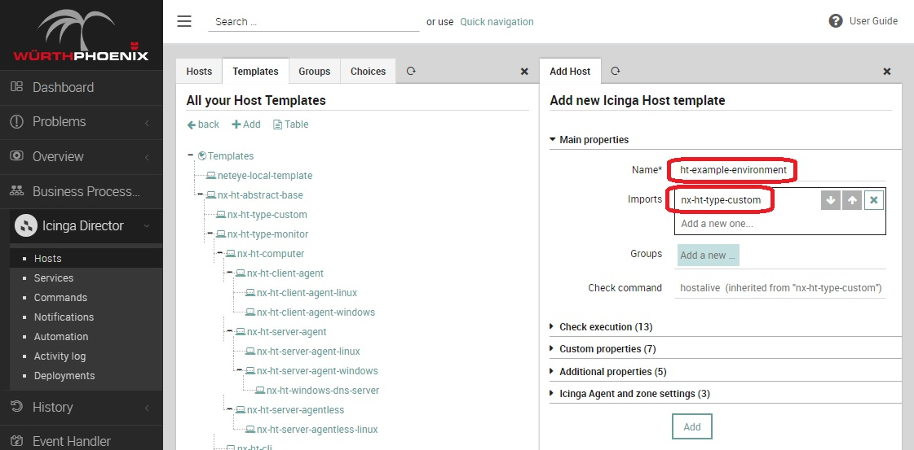
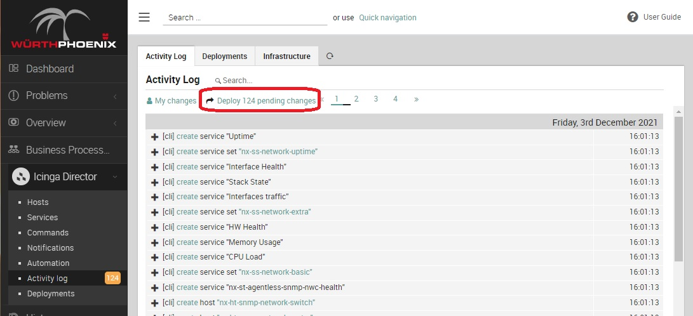
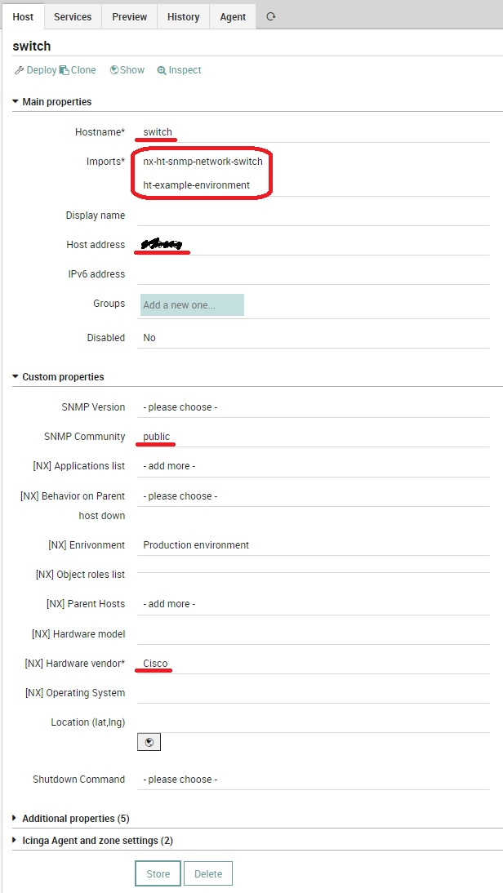
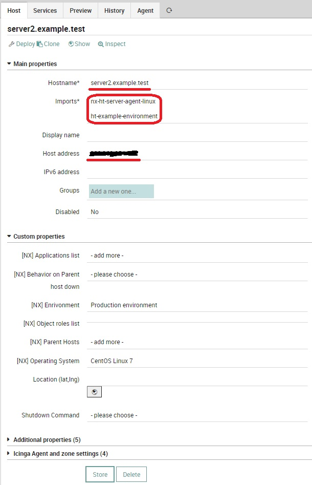
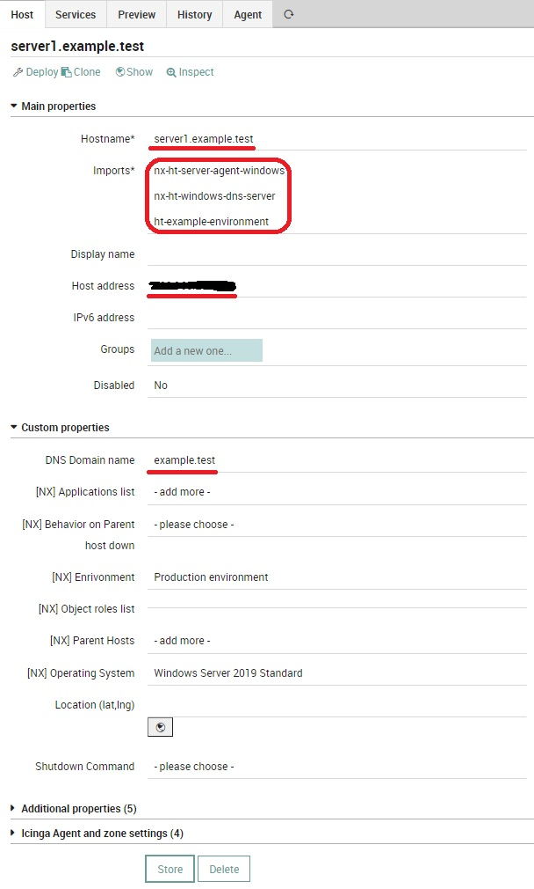
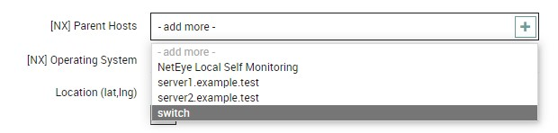

.. _nep-getting-started:

***************************
 Getting Started with NEPs
***************************

Beginning with NetEye Extension Packs can be not so easy, especially for those who are new to Icinga2 and Director logics.
Although NetEye Extension Packs are born to make things easy, a little help in the beginning can be required.
This Getting Started aims to:

* Show :ref:`how to install NEP Contents on your NetEye<nep-getting-started-install-nep>`
* :ref:`Monitor an example environment<nep-getting-started-monitor-environment>` after setting up the required Packages

What this Getting Started will not do:

* Explain the basics of NEP philosophy
* Dig into the installation and setup processes
* Explore the Packages required by the example environment
* Explore the other Packages provided with NEP

Therefore, remember to read the online documentation to get more insight of NEPs and details on how they work.

.. _nep-getting-started-install-nep:
.. _nep-getting-started-install-nep-single-node:

Install NEP on your NetEye Single Node
======================================

Before installing NEP, ensure you have access to the right Online Repos as describet at :ref:`Enable access to external repos<nep-obtaining-nep-external-repos>`.

As described at :ref:`Online Resources<nep-online-resources>` and :ref:`Obtaining NEP<nep-obtaining-nep>`, NEP can be installed on your NetEye from two sources. If you require the last stable version, install it from Wuerth Phoenix's RPM Repository. If you require the latest development release, install it from NEP's Public GitHub Repository. Just install from one of the two sources, and make sure you don't use both of them.
In both cases, make sure your NetEye has a working Internet Connection.

Install NEP from RPM Repository
-------------------------------
To install NEP from from Wuerth Phoenix's RPM Repository ``neteye-contrib``, just use Yum to install ``neteye-nep`` RPM inside your NetEye Server:

.. code:: bash

    yum --enablerepo=neteye-contrib install neteye-nep

Now, all available NEP Contents are available from directory ``/usr/share/neteye/nep/``.

Install NEP on your NetEye Cluster
==================================

As described at :ref:`Online Resources<nep-online-resources>` and :ref:`Obtaining NEP<nep-obtaining-nep>`, NEP can be installed on your NetEye from two sources. If you require the last stable version, install it from Wuerth Phoenix's RPM Repository. If you require the latest development release, install it from NEP's Public GitHub Repository. Just install from one of the two sources, and make sure you don't use both of them.
In both cases, make sure your NetEye has a working Internet Connection.
*Remember to perform the steps on all NetEye Opeartive Cluster Nodes when required.*

Install NEP from RPM Repository
-------------------------------
To install NEP from from Wuerth Phoenix's RPM Repository ``neteye-contrib``, just use DNF to install neteye-nep RPM *on all Operative Cluster Nodes*:

.. code:: bash

    dnf --enablerepo=neteye-contrib install neteye-nep

Now, all available NEP Contents are available from directory ``/usr/share/neteye/nep/``.
Remember to perform the :ref:`Create Cluster Resources<nep-getting-started-create-cluster-resources>` step.

.. _nep-getting-started-create-cluster-resources:

Create Cluster Resources
------------------------
To complete installation of NEP on a NetEye Cluster, the required Cluster Resources must be created.
Directory ``/neteye/shared/nep/`` must be shared across all Operative Cluster Nodes. Otherwise, ``nep-setup`` will not be able to sync data across all Cluster Nodes.

On a NetEye Cluster, review the resource configuration file located at :file:`/etc/neteye-services.d/contrib/nep.yaml`
and adapt it to your environment, if needed.

Once done, ensure it is properly synced on all |ne| nodes by running:

.. code:: bash

    neteye config cluster sync

After that, you can create the Cluster Resources for NEP by running:

.. code:: bash

    neteye cluster install

.. _nep-getting-started-monitor-environment:

Monitor an example environment
==============================

Let's consider a very simple environment composed by:

* One managed network switch
* One Windows DNS Server (named ``server1.example.test``, hosting Domain ``example.test``)
* One Linux Server (named ``server2.example.test``)
* One NetEye Server

Both servers are attached at that network switch. Both servers have Icinga2 Agent installed and configured to talk with the NetEye Server.

Prepare for monitoring your environment
---------------------------------------
Given the composition of the example environment, some NEP Packages must be setup to make the necessary building blocks available:

* Basic monitoring for servers is available available through ``nep-common``
* Windows DNS Server monitoring is available through the dedicated package ``nep-server-dns``
* Common Network devices monitoring is available through the dedicated package ``nep-network-base``

The Setup procedure will make them ready for use. Supposing NEP Contents are available in  your NetEye server at directory ``/usr/share/neteye/nep/``, run these commands on your NetEye Server:

.. code:: bash

    nep-setup install nep-common
    nep-setup install nep-server-dns
    nep-setup install nep-network-base

The output of each setup might be a little verbose, so the next screenshot reports only the output of ``nep-common`` setup.

Now that everything has been setup, create a new Host Template for the current environment named ``ht-example-environment``.
This Host Template will be used to distribute common custom variables and for tweaking monitoring frequencies for this environment.

Now, several changes have been made to NetEye Configuration. Just Deploy it before continuing. This will ensure you are in a consistent state before creating your own monitoring configuration. Remember that the number of pending changes might vary based on the version of NEP you are using.

Monitor the devices
-------------------
Now that the building blocks are in place, it is possible to model and create the Host Objects representing the devices to monitor.

First is the network switch.
It will be monitored via SNMP, so make sure to have its Read SNMP Community.
Then, create a new Host Object and make sure to assign:

* a valid name (that can be ``switch``)
* assign Host Templates ``nx-ht-status-ping``, ``nx-ht-snmp-network-switch`` and ``ht-example-environment``
* the right IP address
* its Read SNMP Community
* Provide at least the Hardware Vendor

Second, the Linux Server.
It will be monitored via Icinga2 Agent. Since this server has not a specific role, a generic monitoring can suffice.
Now, create a new Host Object and make sure to assign:

* its FQDN (in this case, ``server2.example.test``)
* assign Host Templates ``nx-ht-status-ping``, ``nx-ht-server-agent-linux`` and ``ht-example-environment``
* the right IP address
* if you want, select the right Operating System from the dropdown list and the right Environment

Unfortunately, not all the required monitoring plugins are available on a Linux Server. To correctly monitor this server, transfer some monitoring plugins from NetEye: copy these 3 plugins into ``/usr/lib64/nagios/plugins`` on the linux server:

.. code:: bash

    /neteye/shared/monitoring/plugins/check_mem.pl
    /neteye/shared/monitoring/plugins/check_systemd_service
    /usr/lib64/neteye/monitoring/plugins/check_uptime

Last, the Windows Server.
This server has the specific role of a DNS Server, therefore a combination of Host Templates from ``ht-nx-type-monitoring`` must be used: ``nx-ht-server-agent-windows`` will provide basic monitoring capabilities, and ``nx-ht-windows-dns-server`` will provide specific monitoring for a Windows-based DNS Server.
Create a new Host Object and make sure to assign:

* its FQDN (in this case, ``server2.example.test``)
* assign Host Templates ``nx-ht-status-ping``, ``nx-ht-server-agent-windows``, ``nx-ht-windows-dns-server`` and ``ht-example-environment``
* the right IP address
* the DNS Domain this DNS Server hosts
* if you want, select the right Operating System from the dropdown list and the right Environment

Yum can now deploy the configuration: a whole set of services will be deployed and used to monitor your environment.

Configure Dependencies
----------------------
Since both ``server1.example.test`` and ``server2.example.test`` are attached to the same network switch, it should be set as *Parent Host* for both of them. Just edit on the two Host Objects the property Parent Host and select ``switch` from the list. You can change the behavior of Icinga2 in case ``switch`` goes down by changing the value of property *Behavior on Parent Host down*.

Now, after the next deploy, in case ``switch`` goes down NetEye will mark both ``server1.example.test`` and ``server2.example.test`` as Unreachable.

Continue learning NEP
=====================

Now that your first monitoring is up and running, dig more into NEP by continuing in reading the documentation.
